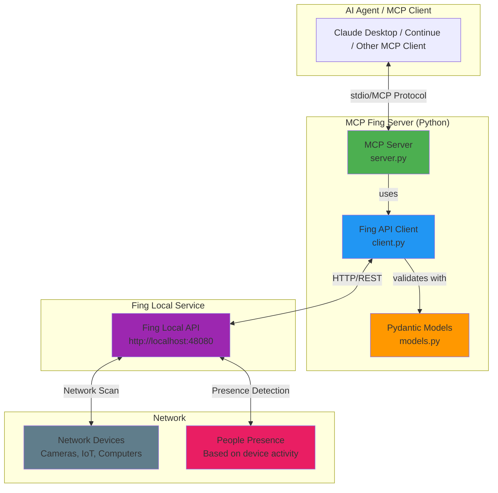
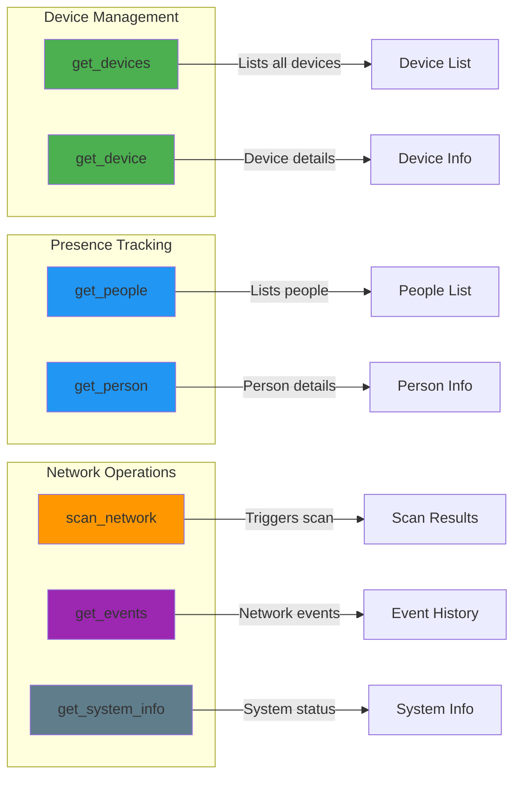
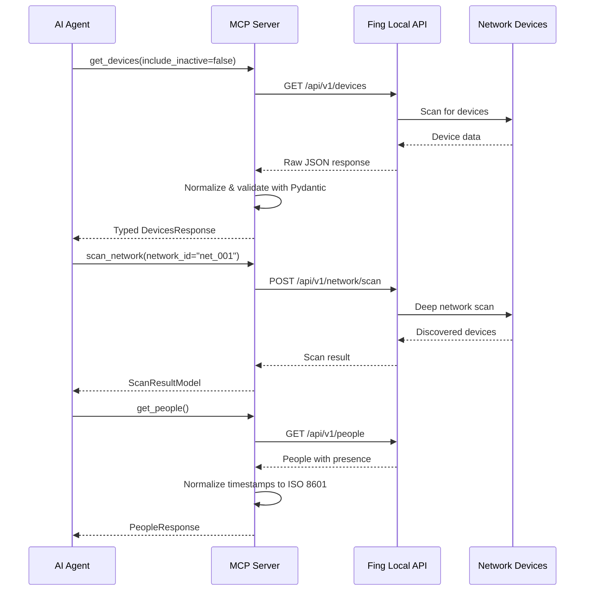
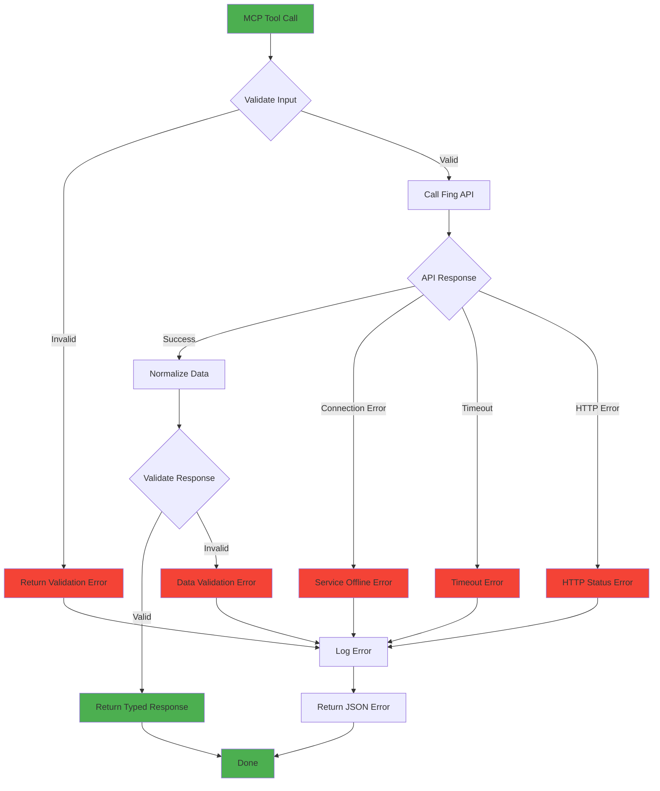

# MCP Fing Server Architecture

```mermaid
flowchart TB
    subgraph "AI Agent / MCP Client"
        Client[Claude Desktop / Continue / Other MCP Client]
    end
    
    subgraph "MCP Fing Server (Python)"
        Server[MCP Server<br/>server.py]
        Client_Wrapper[Fing API Client<br/>client.py]
        Models[Pydantic Models<br/>models.py]
        
        Server -->|uses| Client_Wrapper
        Client_Wrapper -->|validates with| Models
    end
    
    subgraph "Fing Local Service"
        Fing[Fing Local API<br/>http://localhost:48080]
    end
    
    subgraph "Network"
        Devices[Network Devices<br/>Cameras, IoT, Computers]
        People[People Presence<br/>Based on device activity]
    end
    
    Client <-->|stdio/MCP Protocol| Server
    Client_Wrapper <-->|HTTP/REST| Fing
    Fing <-->|Network Scan| Devices
    Fing <-->|Presence Detection| People
    
    style Server fill:#4CAF50
    style Client_Wrapper fill:#2196F3
    style Models fill:#FF9800
    style Fing fill:#9C27B0
    style Devices fill:#607D8B
    style People fill:#E91E63
```

## MCP Tools Provided

```mermaid
flowchart LR
    subgraph "Device Management"
        T1[get_devices]
        T2[get_device]
    end
    
    subgraph "Presence Tracking"
        T3[get_people]
        T4[get_person]
    end
    
    subgraph "Network Operations"
        T5[scan_network]
        T6[get_events]
        T7[get_system_info]
    end
    
    T1 -->|Lists all devices| Devices_Out[Device List]
    T2 -->|Device details| Device_Out[Device Info]
    T3 -->|Lists people| People_Out[People List]
    T4 -->|Person details| Person_Out[Person Info]
    T5 -->|Triggers scan| Scan_Out[Scan Results]
    T6 -->|Network events| Events_Out[Event History]
    T7 -->|System status| System_Out[System Info]
    
    style T1 fill:#4CAF50
    style T2 fill:#4CAF50
    style T3 fill:#2196F3
    style T4 fill:#2196F3
    style T5 fill:#FF9800
    style T6 fill:#9C27B0
    style T7 fill:#607D8B
```

## Data Flow

```mermaid
sequenceDiagram
    participant Client as AI Agent
    participant MCP as MCP Server
    participant Fing as Fing Local API
    participant Network as Network Devices
    
    Client->>MCP: get_devices(include_inactive=false)
    MCP->>Fing: GET /api/v1/devices
    Fing->>Network: Scan for devices
    Network-->>Fing: Device data
    Fing-->>MCP: Raw JSON response
    MCP->>MCP: Normalize & validate with Pydantic
    MCP-->>Client: Typed DevicesResponse
    
    Client->>MCP: scan_network(network_id="net_001")
    MCP->>Fing: POST /api/v1/network/scan
    Fing->>Network: Deep network scan
    Network-->>Fing: Discovered devices
    Fing-->>MCP: Scan result
    MCP-->>Client: ScanResultModel
    
    Client->>MCP: get_people()
    MCP->>Fing: GET /api/v1/people
    Fing-->>MCP: People with presence
    MCP->>MCP: Normalize timestamps to ISO 8601
    MCP-->>Client: PeopleResponse
```

## Error Handling

```mermaid
flowchart TD
    Start[MCP Tool Call] --> Validate{Validate Input}
    Validate -->|Invalid| Error1[Return Validation Error]
    Validate -->|Valid| CallAPI[Call Fing API]
    
    CallAPI --> CheckAPI{API Response}
    CheckAPI -->|Success| Normalize[Normalize Data]
    CheckAPI -->|Connection Error| Error2[Service Offline Error]
    CheckAPI -->|Timeout| Error3[Timeout Error]
    CheckAPI -->|HTTP Error| Error4[HTTP Status Error]
    
    Normalize --> ValidateData{Validate Response}
    ValidateData -->|Valid| Success[Return Typed Response]
    ValidateData -->|Invalid| Error5[Data Validation Error]
    
    Error1 --> Log[Log Error]
    Error2 --> Log
    Error3 --> Log
    Error4 --> Log
    Error5 --> Log
    
    Log --> Return[Return JSON Error]
    Success --> Done[Done]
    Return --> Done
    
    style Start fill:#4CAF50
    style Success fill:#4CAF50
    style Done fill:#4CAF50
    style Error1 fill:#f44336
    style Error2 fill:#f44336
    style Error3 fill:#f44336
    style Error4 fill:#f44336
    style Error5 fill:#f44336
```
